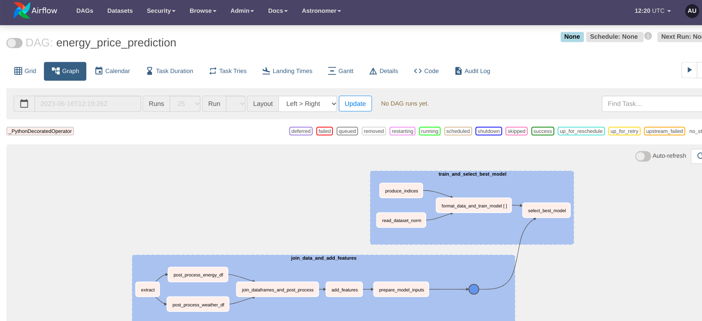

# Energy Price Prediction Pipeline

<strong><code>
Tools: Python, Numpy, Pandas, XGBoost, Airflow, Google Cloud Storage, SQL, BigQuery
</code></strong>

This project aims to predict energy prices using historical data and machine learning techniques. The workflow is designed as an Airflow DAG (Directed Acyclic Graph) and consists of several tasks organized into task groups. The tasks include data preparation, model training, and model selection.

## Setup

To run this project, ensure that you have the following prerequisites:

- Airflow installed and configured
- Google Cloud Storage (GCS) set up
- The necessary Python libraries installed (numpy, pandas, xgboost, airflow, google-cloud-storage)

## Project Structure

The project consists of the following files:

- `Readme_ELT_EnergyPricePrediction.md`: This file, providing an overview of the project.
- `dags/week_2/price-prediction-pipeline.py`: The main script containing the Airflow DAG definition.
- `common/week_2/model.py`: Python module containing functions for multivariate data preparation and XGBoost model training.
- `common/week_2/feature_engineering.py`: Python module containing functions for joining data and adding features.

## DAG Overview

The DAG is defined in `price-prediction-pipeline.py` using the `DAG` decorator provided by Airflow. The DAG has the following characteristics:

- **DAG ID**: energy_price_prediction
- **Schedule Interval**: None (manual triggering)
- **Start Date**: January 1, 2021
- **Default Arguments**: Owner is set to "Dze Richard", and task retries are set to 2 with a retry delay of 60 seconds.

The DAG consists of two task groups:

1. **group_1**: This task group is responsible for data preparation, specifically joining data and adding features.
2. **group_2**: This task group is responsible for training XGBoost models and selecting the best model based on evaluation scores.

The tasks are executed in the following order: `group_1` is followed by `group_2`.

## Task Groups

### group_1: Join Data and Add Features

This task group consists of the following tasks:

- **join_data_and_add_features**: This task reads the necessary dataset from Google Cloud Storage, joins the data, and adds relevant features. The output is a preprocessed dataset.

### group_2: Train and Select Best Model

This task group consists of the following tasks:

- **read_dataset_norm**: This task reads the preprocessed dataset from Google Cloud Storage.
- **produce_indices**: This task produces a list of training and validation indices for model training.
- **format_data_and_train_model**: This task takes the preprocessed dataset and a pair of training and validation indices, formats the data, and trains an XGBoost model.
- **select_best_model**: This task selects the best model from the trained models based on evaluation scores and saves it to Google Cloud Storage.

The `format_data_and_train_model` task is dynamically mapped based on the number of pairs of training and validation indices to be produced.

## Custom Functions

The DAG includes custom functions that facilitate the data preparation and model training process:

- **multivariate_data**: This function prepares multivariate data for training by sliding windows over the dataset and creating input and output sequences.
- **train_xgboost**: This function trains an XGBoost model using the prepared training and validation data.

## Usage

1. Ensure that Airflow is properly configured and running.
2. Set up Google Cloud Storage and place the necessary dataset files in the specified location.
3. Update the project-specific configuration variables in `price-prediction-pipeline.py`, such as `TRAINING_DATA_PATH` and `DATASET_NORM_WRITE_BUCKET`, to match your setup.
4. Create the necessary connections in Airflow for Google Cloud Storage.
5. Trigger the DAG execution in Airflow.

## Conclusion

This Airflow DAG provides a workflow for predicting energy prices using historical data and XGBoost models. By following the steps outlined in this README, you can set up and run the project to train models and select the best-performing model for energy price prediction.