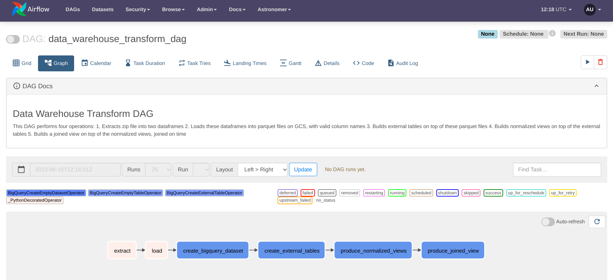

# Energy & Weather Analytics ELT Pipeline 

<strong><code>
Tools: Python, Pandas, Airflow, Google Cloud Storage, SQL, BigQuery
</code></strong>

This project contains an Airflow DAG serving as pipeline orchestrating energy and weather data extraction and transformation operations in a data warehouse. The DAG performs the following operations:

**EXTRACT**
1. Extracts a zip file into two pandas DataFrames ("generation"(energy) & "weather").
 
**LOAD**

2. Loads the extracted DataFrames into parquet files on Google Cloud Storage (GCS) with valid column names.

**TRANSFORM**

3. Builds external tables on top of the parquet files in BigQuery.
4. Builds normalized views on top of the external tables in BigQuery.
5. Builds a joined view on top of the normalized views, joined on the time column.

## Setup

To run this project, make sure you have the following prerequisites:

- Airflow installed and configured using the astro CLI
- Google Cloud Storage (GCS) and BigQuery set up
- The necessary Python libraries installed (pandas, airflow, google-cloud-storage)

## Project Structure

The project consists of the following files:

- `Readme_ELT_Energy_Weather_Bigquery_Analytics.md`: This file, providing an overview of the project.
- `dags/week_3/data-warehouse-tx.py`: The main script containing the Airflow DAG definition.
- `common/week_3/config.py`: Configuration file containing constants and data definitions.

## Usage

1. Ensure that Airflow is properly configured and running.
2. Place the zip file containing the data to be processed in the specified location: `dags/data/energy-consumption-generation-prices-and-weather.zip`.
3. Update the project-specific configuration variables such as `PROJECT_ID`, `DESTINATION_BUCKET`, and `BQ_DATASET_NAME`, to match your setup.
4. Create the necessary connections in Airflow for GCS and BigQuery.
5. Trigger the DAG execution in Airflow.

## DAG Overview

The DAG is defined in `data-warehouse-tx.py` using the `@dag` decorator provided by Airflow. The DAG has the following characteristics:

- **Schedule Interval**: None (manual triggering)
- **Start Date**: January 1, 2021
- **Catchup**: False (do not run backfill for previous dates)
- **Default Arguments**: Owner is set to "Dze Richard", and task retries are set to 2 with a retry delay of 60 seconds.

The DAG consists of several tasks organized into task groups:

1. **extract**: This task extracts the zip file into two pandas DataFrames, one for each file in the zip.
2. **load**: This task takes the extracted DataFrames and loads them into parquet files on GCS. The column names are formatted to be BigQuery-compliant.
3. **create_bigquery_dataset**: This task group creates a BigQuery dataset if it doesn't already exist.
4. **create_external_tables**: This task group creates external tables on top of the parquet files stored in GCS.
5. **produce_normalized_views**: This task group produces normalized views on top of the external tables.
6. **produce_joined_view**: This task group produces a joined view on top of the normalized views.

The tasks are executed in the following order: `load` depends on `extract`, `create_bigquery_dataset` depends on `load`, `create_external_tables` depends on `create_bigquery_dataset`, `produce_normalized_views` depends on `create_external_tables`, and `produce_joined_view` depends on `produce_normalized_views`.

## Custom Functions

The DAG includes custom functions that facilitate the data transformation process:

- **produce_select_statement**: This function produces a select statement that can be used to create a normalized view on top of an external table. It accepts the timestamp column name and a list of columns to select, and programmatically builds the select statement.

## Conclusion

This Airflow DAG provides a data transformation workflow for loading, transforming, and querying energy(generation + pricing) & weather data in a data warehouse. It can be customized and extended to meet specific requirements.